# Application for Organizing with chat, video calls, tasks, projects etc.

<details>
<summary>
User managment
</summary>
Assigne managers, and define access on role bases

</details>
<details>
<summary>
Calendar
</summary>
Manage  meetings & vations in one place. 
Import calendar to your device and be up to date with your work.

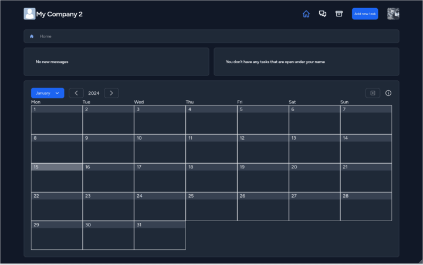
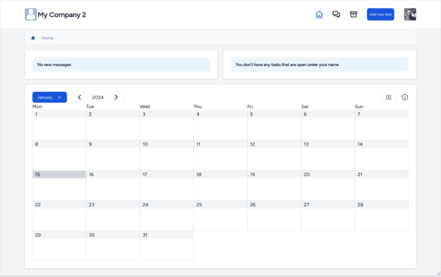
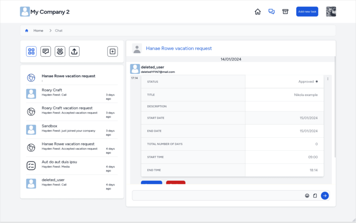

### Vacations

When user creates vacation, in case that they don't have `can-approve-vacation` privilage and have manager, the vacation approval request will be sent to chat with all managers.

example:

```
 -- Manager 1 (big boss, has can-approve-vacation privilage)
 ----- Manager 2 (has can-approve-vacation privilage)
 -------- Manager 3
 ------------ Worker
```

when worker submits vacation request all managers will be added to chat, history of vacation approval will be also visible in chat. `Manager 3` will be able to approve vacation, but status won't change until `Manager 2` or `Manager 1` approve it.

</details>

<details>
<summary>
Chat & Video Calls
</summary>
Feature allos users to make 1 on 1 and group chat. Beside chat, users can organize video calls. In CollabHub chat is not just tool to comunicate with your collages and/or customers, everything is centered around it (example: if someone comments on task - you will get chat message.).

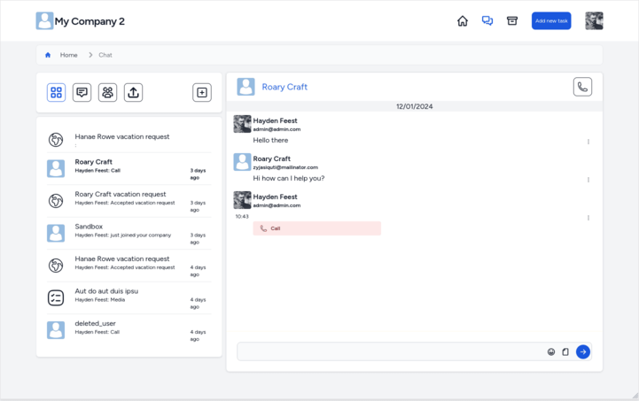

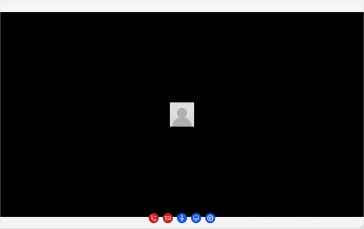

</details>

<details>
<summary>
Project managment
</summary>

Project managment in CollabHub is created to be as simple as possible. For now it constits of

-   Projects
-   Tasks
-   Bords (scrum and kanban)
-   Documents

All tasks that are not in status "closed" with due date will be added to calendar

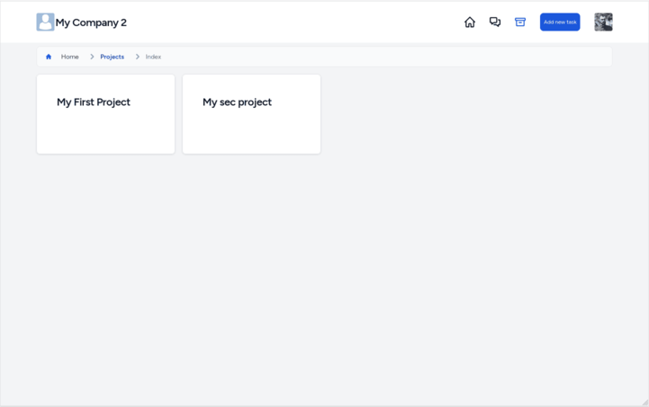
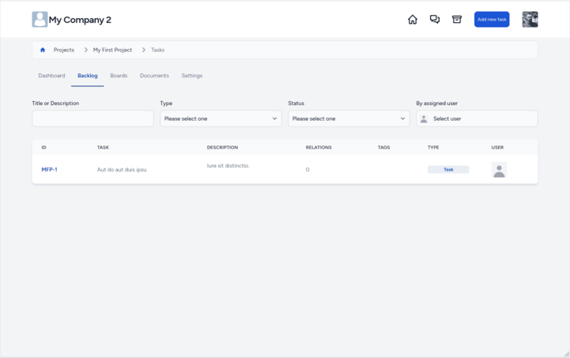
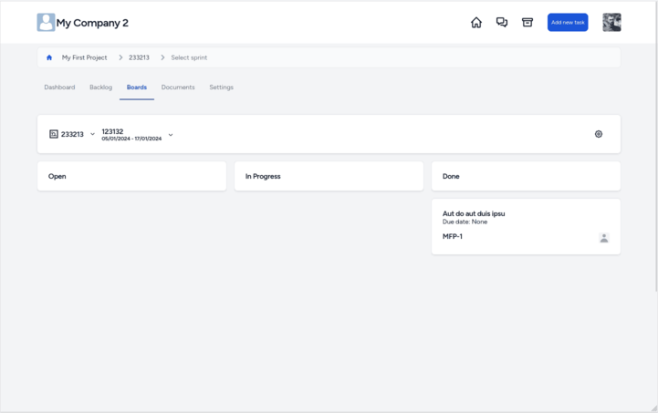

</details>
<details>
<summary>
Invoicing
</summary>
You can add customer company and manage invoices and payments.

Billing settings:

-   billable items
-   currency
-   predefined notes

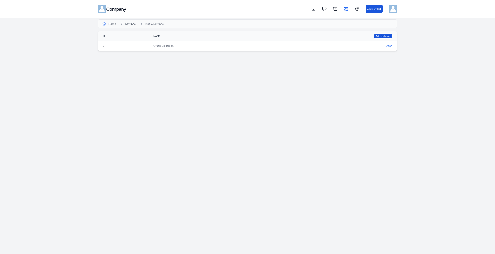
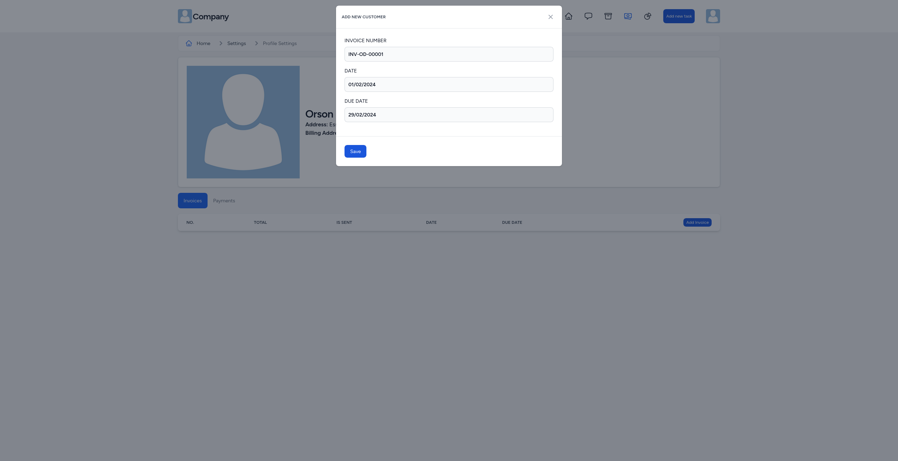
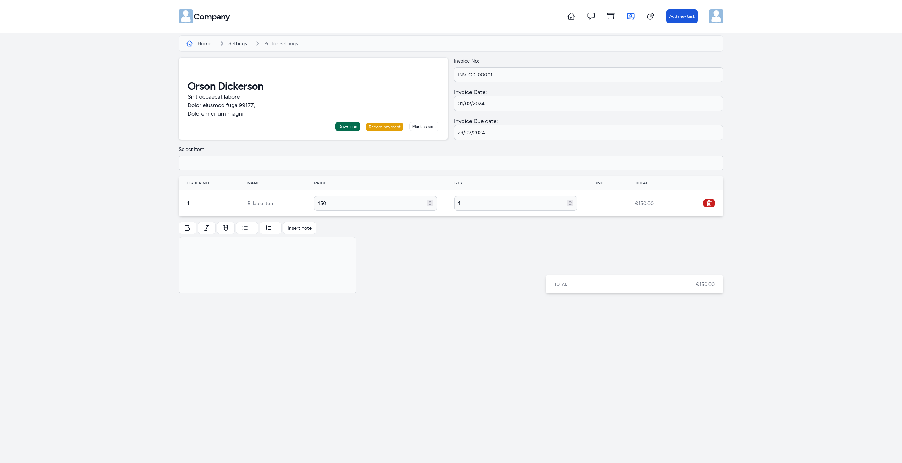

</details>

## For develpers

Application is written in laravel and vue3 SPA.
Vue3 application is standalone integrated in laravel blade. For authentication is used Laravel sencrum.

### Folder structure

-   Backend is following Laravel practices (TBD)
-   frontend
    -   folder names `snake_case`
    -   component names `CamelCase`
    -   javascript variables `camelCase`

# Features

-   [x] Chat
-   [x] Video cals
-   [x] Create chat
-   [x] Projects
-   [x] Tasks
-   [x] Documents
-   [x] Boards (sprint and kanban)
-   [x] Project settings
-   [x] User groups
-   [x] Set user groups on company level
-   [x] Update user permissions on company level
-   [x] Update user permissions on project level
-   [x] Set task statuses per board
-   [x] Add task to board / sprint when creating
-   [x] Company dashboard
-   [x] Invoicing
-   [x] Customer companies
-   [x] Calendar
-   [x] Calendar event invitation accept/decline
-   [x] Calendar event preview
-   [x] Calendar vacations
-   [ ] Project dashboard
-   [ ] Task custom fields
-   [ ] Users in customer companies
-   [ ] Documents live update and cursors
-   [ ] Webhooks
-   [ ] Git integration
-   [ ] Mutiliselect tasks on board with options for status change option
-   [ ] Filter tasks in board
-   [ ] Group tasks in board

# License

MIT License

Permission is hereby granted, free of charge, to any person obtaining a copy of this software and associated documentation files (the "Software"), to deal in the Software without restriction, including without limitation the rights to use, copy, modify, merge, publish, distribute, sublicense, and/or sell copies of the Software, and to permit persons to whom the Software is furnished to do so, subject to the following conditions:

The above copyright notice and this permission notice shall be included in all copies or substantial portions of the Software.

THE SOFTWARE IS PROVIDED "AS IS", WITHOUT WARRANTY OF ANY KIND, EXPRESS OR IMPLIED, INCLUDING BUT NOT LIMITED TO THE WARRANTIES OF MERCHANTABILITY, FITNESS FOR A PARTICULAR PURPOSE AND NONINFRINGEMENT. IN NO EVENT SHALL THE AUTHORS OR COPYRIGHT HOLDERS BE LIABLE FOR ANY CLAIM, DAMAGES OR OTHER LIABILITY, WHETHER IN AN ACTION OF CONTRACT, TORT OR OTHERWISE, ARISING FROM, OUT OF OR IN CONNECTION WITH THE SOFTWARE OR THE USE OR OTHER DEALINGS IN THE SOFTWARE.
